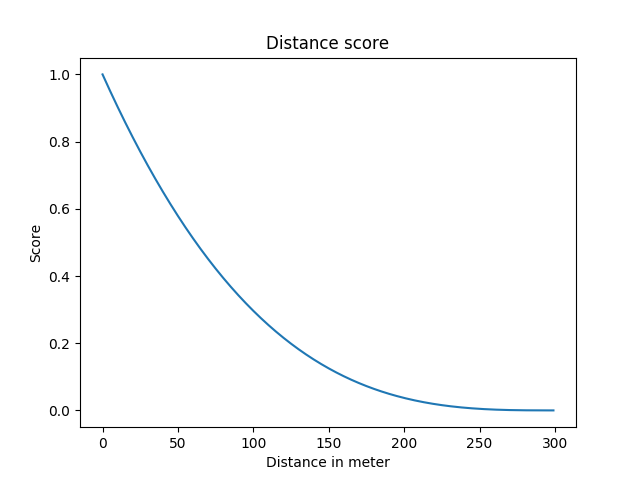

The Intersection Control Algorithm (ICA) is ment to minimize waiting for a traffic lights.
The algorithm has to work for a wide range of intersections to be able to deploy it globally.
The first step is advising speed to (non)-autonomous vehicles driving towards an intersection.
After that we’ll minimize the use of traffic lights and head towards a
fluent flow of vehicles crossing intersections without traffic lights.

<a href="./introduction-and-approach.pdf" target="self" icon="true">Introduction paper</a>

**Now** the blue vehicle has to stop to avoid the pink vehicle.

<video width="400" controls>
  <source src="https://firebasestorage.googleapis.com/v0/b/project-1236391238174251673.appspot.com/o/videos%2Fsimulation-now.mp4?alt=media&token=63e07174-5aec-4e7f-937a-c48244de245f" type="video/mp4" />
  Your browser does not support the video tag.
</video>

**Future** vehicles receive a suggested speed so they don’t have to stop.

<video width="400" controls>
  <source src="https://firebasestorage.googleapis.com/v0/b/project-1236391238174251673.appspot.com/o/videos%2Fsimulation-future.mp4?alt=media&token=9f72d621-495a-45ee-b577-790852589cf8" type="video/mp4" />
  Your browser does not support the video tag.
</video>


## Lane Score Algorithm

### Current Traffic Light Systems

The way traffic lights currently work has been around for at least 30 years, since then traffic has grown a lot. The current technology that is used to manage traffic lights is not very efficient. The traffic lights switch at predetermined intervals, these intervals have to be manually made for every intersection which is very time consuming.

### The Score Algorithm

In order to give each lane a priority score the intersection communicates with the vehicles driving towards the intersection. The score is then calculated based on the amount of vehicles on a lane, the distance of each vehicle to the intersection and the time a vehicle has been waiting. All these factors have a weight, these weights can be manipulated to balance the algorithm. More factors with weights can be added easily, e.g. emergency vehicles could be given an _infinite_ weight for their lane always to turn green.

### Implementation

The video below is the first implementation of the score algorithm. The score of each lane is shown at the bottom right. The traffic lights are still switching at predetermined intervals but are now switching to the lane with the highest priority score. The next version will calculate the priority score for each lane a couple of seconds a head. That is needed to be able to give each vehicle the correct advice speed.

<video controls>
  <source src="https://firebasestorage.googleapis.com/v0/b/project-1236391238174251673.appspot.com/o/videos%2Fscore.mp4?alt=media&token=3720a090-cce7-48d1-8a8f-831acb6b3b61" type="video/mp4" />
  Your browser does not support the video tag.
</video>

### Distance Weight Formula

The formula below is used to calculate the weight of the lane by distance ($D$). The closer a vehicle is to the intersection, the bigger the weight for that lane. The average coverage of a vehicle communication system is 300 meter, so we decided to start
counting the weight from 300 meter.

$$
D=-\left(\frac{1}{300}\right)^{3}\cdot(x - 300)^{3}
$$

The next graph shows the priority score of a lane for the distance of a vehicle to the intersection.

<div style="max-width: 550px; margin: 0 auto;">
  
</div>

### Score Algorithm Code

```python
TL[laneID] = distanceWeight(lane, laneID) + stopWeight(lane)
def stopWeight(lane):
    stopWeight = 0.01
    return np.sum(waitingFrames[lane]) * stopWeight

def distanceWeight(lane, laneID):
    distanceWeight = 0.5
    imaginaryDistance = 300
    imaginaryDistanceWeight = 0
    distance = np.power(1 / imaginaryDistance, 3) * np.power(distance(laneID, x, y) - imaginaryDistance, 3)
    return np.sum(-distance , lane) * distanceWeight

def softmax(z):
    z -= np.amax(z)
    return np.exp(z) / np.sum(np.exp(z))

def distance(laneID, x, y):
    tlPosition = np.asarray(traci.lane.getShape(laneID)[1])
    delta = np.subtract(tlPosition, [x, y])
    return np.sqrt(np.add(np.power(delta[0], 2), np.power(delta[1], 2)))
```

# The simulation

#### SUMO introduction

[Simulation of Urban MObility](http://sumo.dlr.de/index.html) (SUMO) is an open source traffic simulation program able to simulate large road networks. SUMO has a lot of changeable parameters and it comes with an python API which you can use to change parameters of the
simulation in real time. For more information see the [SUMO wiki page](http://sumo.dlr.de/wiki/Simulation_of_Urban_MObility_-_Wiki) or the [API wiki page](http://sumo.dlr.de/wiki/TraCI).


## Prototypes

<a href="https://github.com/mikeheddes/Intersection-Control" icon="true">Code on Github</a>

Iteration 1: **First simulation**

<video controls>
  <source src="https://firebasestorage.googleapis.com/v0/b/project-1236391238174251673.appspot.com/o/videos%2Fsimulation_1.mp4?alt=media&token=82b37836-118e-4c17-a4f5-59668d4092d5" type="video/mp4" />
  Your browser does not support the video tag.
</video>

The first simulation takes place at a basic intersection. All vehicles spawn random to create a realistic traffic scenario. Once a vehicle spawns it sends it’s ID and location to the system. The system calculates and sends back a speed advice using the vehicle’s location and the time it takes for the traffic light to turn green. The vehicle receives the speed advice and adjusts automatically.

---

Iteration 2: **Changed notification distance**

<video controls>
  <source src="https://firebasestorage.googleapis.com/v0/b/project-1236391238174251673.appspot.com/o/videos%2Fsimulation_2.mp4?alt=media&token=da164019-5df3-4dfb-ba56-c9207038c13d" type="video/mp4" />
  Your browser does not support the video tag.
</video>

The simulation now takes in account the amount and length of the vehicles in front. In the previous iteration each vehicle would only look at how far it is from the traffic light and would adapt it's speed so it would be there on time.

---

Iteration 3: **Algorithms combined**

<video controls>
  <source src="https://firebasestorage.googleapis.com/v0/b/project-1236391238174251673.appspot.com/o/videos%2Fsimulation_3.mp4?alt=media&token=b85df9ad-b281-44a4-bf17-a5c2e144df03" type="video/mp4" />
  Your browser does not support the video tag.
</video>

The simulation implements both the advise speed algorithm and the lane score algorithm to switch the light to the lane with the highest priority. Because the fr advise speed is calculated with the traffic light switch time, the system has to predict when the light will turn green. This can be improved by creating a prediction model.

---

### Data use

During the simulation a lot of data is gained and can be processed to graphes and other visualization tools. This is data like: Speed, location, CO2 emission and many more. The data can be graphed for any vehicle requested using Matplotlib. In the figure below the speed and position is plotted for cars 1, 2 and 3.


### Further progress

The simulation can be improved by adding more variables. The map can be changed by: adding lanes, vary between different traffic light systems and add random distortion to make the simulation more realistic. The simulation can also be changed by: adding priority vehicles, adding pedestrians or changing the behavior of people.

## Distance Calculator

#### Why a Distance Calculator

In order to advise a speed to (non)-autonomous vehicles we need two units: time and distance. The time is embedded in the system but the distance of the vehicle to the intersection is unknown. To obtain the distance we use the predetermined coordinate of the intersection and the coordinates of the vehicles that will be send in the standard [ETSI TS 102 894-2](https://www.etsi.org/deliver/etsi_ts/102800_102899/10289402/01.02.01_60/ts_10289402v010201p.pdf) messages form.

### [Haversine formula](https://en.m.wikipedia.org/wiki/Haversine_formula)

For calculating the distance ($d$) between two coordinates. With $\varphi$ as latitude, $\lambda$ as longitude and $R$ as earthʼs radius.

$$
a = \sin^2\left(\frac{\Delta\varphi}{2}\right) + \cos\varphi_{1} \cdot \cos\varphi_{2} \cdot \sin^2\left(\frac{\Delta\lambda}{2}\right)
$$

$$
d = 2R \cdot \arctan\left(\sqrt{a}\right)
$$

### Haversine in JavaScript

```javascript
function toRadians(degrees) {
  return (degrees * Math.PI) / 180
}

const R = 6378.137 * 1000
const φ1 = toRadians(lat1)
const φ2 = toRadians(lat2)
const Δφ = toRadians(lat2 - lat1)
const Δλ = toRadians(lng2 - lng1)

const a =
  Math.pow(Math.sin(Δφ / 2), 2) +
  Math.cos(φ1) * Math.cos(φ2) * Math.pow(Math.sin(Δλ / 2), 2)
const d = 2 * R * Math.atan(Math.sqrt(a))
```
