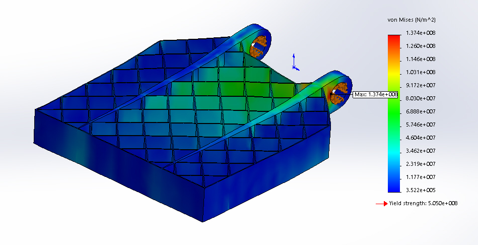
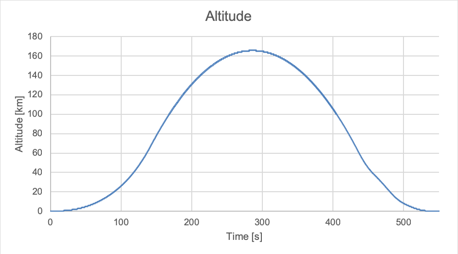

SpaceX is the first private company to successfully launch, orbit, and land a rocket. In 2015 SpaceX was the first to do a successful vertical landing with a Falcon 9 first stage. This was achieved by doing a series of maneuvers after the first stage is separated ([Falcon 9 First Stage Reusability Graphic](https://en.wikipedia.org/wiki/File:Falcon_9_First_Stage_Reusability_Graphic.jpg)). Grid fins on the first stage of the Falcon 9 steer it by producing lift which gives it the ability to roll, pitch and yaw during aerodynamic guidance ([SpaceX grid fins](https://www.spacex.com/news/2015/08/31/grid-fins)). This makes it possible to change the trajectory during the aerodynamic translation maneuver towards the landing site.

> "The landing at Landing Zone 1 was the first time SpaceX had successfully landed the rocket’s first stage."
>
> [Space News](https://spacenews.com/falcon-9-launches-orbcomm-satellites-first-stage-lands/)

The purpose of this article is to create a schematic concept of the grid fin, which is a heavy mechanical and dynamically loaded part, such that the play of forces can be made plausible with the corresponding choice of materials. In addition, drawings of the grid fin are made.

The question to answer with this report is: **what is the design of SpaceX’ grid fin and how is it being fabricated?** In order for this to be answered a drawing of the grid fin is created with the tolerances and roughness. In addition, an explanation of the fabrication process is provided.

# 1. The grid fin
After decades of stagnation in the space industry SpaceX was the first to take the space industry to a higher level by landing and reusing their first stage. To me this is fascinating and very inspiring.

From all the parts that make up a Falcon 9 the grid fin might score the highest on a combination of importance and publicly available resources. Because the grid fins are positioned on the outside of the rocket, they are visible in almost every picture or video as opposed to the Merlin engines that are a SpaceX secret and hidden in the bottom of the rocket.

The first version of the grid fin designed by SpaceX is made of aluminum and measure 4 feet by 5 feet ([SpaceX grid fins](https://www.spacex.com/news/2015/08/31/grid-fins)). See figure 1 for the design of the initial grid fins in undeployed state.

*Figure 1: initial design aluminum grid fins, undeployed in February 2015*

> The improved version of the grid fin is made out of a single piece cast and cut titanium and is able to resist the re-entry heat without shielding.
>
> It is slightly heavier than the shielded aluminum version but has more control authority and can be reused indefinitely with no touch ups.
>
> [Elon Musk](https://twitter.com/elonmusk/status/878821062326198272)

See figure 2 and 3 for the improved design of the grid fins.

*Figure 2: close-up of the newer titanium grid fins first flown in June 2017*

*Figure 3: unmounting titanium grid fin at the port of Los Angeles*

# 2. Stress analysis
To get a realistic view of the maximum stress in a grid fin multiple analysis are made on different times with their corresponding speed and air density, see figure 4 for the two frames with the highest speed and air density combination. The air pressure comes from AVS ([Atmospheric Pressure at Different Altitudes](https://www.avs.org/AVS/files/c7/c7edaedb-95b2-438f-adfb-36de54f87b9e.pdf)). More information on the time, speed and altitude can be found in appendix A.

| Time     | Speed       | Altitude      | Air pressure       | Temperature     | Air density            |
|----------|-------------|---------------|--------------------|-----------------|------------------------|
| T+437 s  | 1377 m/s    | 58.6 km       | 7.24 kPa           | 216 K           | 0.12 kg/m3  |
| T+481 s  | 811 m/s     | 19.2 km       | 46.61 kPa          | 249 K           | 0.65 kg/m3  |
*Figure 4: table of frames with a combination of high speed and air density.*

For each frame two angels of the grid fin are analyzed, 0° offset and 45° offset. The material used for the 2015 model grid fin is aluminum 7075-T6 because it has a high tensile strength, can be heat treated and is commonly used in the aerospace industry ([7 things to consider when choosing an aluminum grade](https://www.metalsupermarkets.com/7-things-consider-choosing-aluminum-grade/)). See figure 5 for the [properties of aluminum 7075-T6](http://asm.matweb.com/search/SpecificMaterial.asp?bassnum=MA7075T6).

| Property         |	Value    | Unit |
|------------------|-----------|------|
| Elastic modules	 | 71.7	     | GPa  |
| Shear modules	   | 26.9	     | GPa  |
| Tensile strength | 572	     | MPa  |
| Yield strength   | 503       | MPa  |
| Melting point    | 750 - 908 | K    |
*Figure 5: table with properties of aluminum 7075-T6*

The results of the analysis show that at T+481 with the grid fin rotated 45° the grid fin has the highest stress. There is a safety factor of 3.5 till the stress is higher than the yield strength and permanent displacement will occur.

## 2.1 Critical load and stress
During the highest stress on the grid fin the first stage is falling towards Earth with 2.5 times [the speed of sound](https://en.wikipedia.org/wiki/Speed_of_sound) with a surrounding air pressure of 46.61 kPa and a grid fin angle of 45°. The air colliding with the grid fin creates high pressure zones where the air is slowed down from the perspective of the grid fin. See figure 6 for a cross-section of the pressure.

<video controls>
  <source src="https://firebasestorage.googleapis.com/v0/b/project-1236391238174251673.appspot.com/o/videos%2Fgrid-fin-2015-air_pressure.mp4?alt=media&token=3cf3f616-713a-4eb2-add8-7e4ae934fc18" type="video/mp4" />
  Your browser does not support the video tag.
</video>

*Figure 6: front view pressure cross section*

This pressure creates a force on the grid fin which results in stress and displacement. See figure 7 for the stress distribution in the grid fin and figure 8 for the resulting displacement.

*Figure 7: isometric view stress distribution*

*Figure 8: isometric view displacement distribution*

## 2.2. External influence
Heat as a result of friction is an important factor to keep in mind when designing a grid fin. This is also part of why SpaceX went from an aluminum grid fin with heat shielding to a titanium grid fin which doesn’t need heat shielding. The aluminum heat shielding needed to be replaced after every flight while the titanium version can be reused indefinitely.
 
# 3. Detailed design
Figure 10 shows the grid fin assembly with deployment mount and bearings.

<a href="./grid_fin-2015-drawing.pdf" target="self" icon="true">The drawing of the grid fin part</a>

*Figure 10: grid fin assembly with deployment mount and bearings*

## 3.1 Fabrication process
The grid fin part is first casted in a very rough block with enough extra material to refine, at least 10 mm up to 50 mm. The second step is to cut a more accurate size but still with some extra material to refine, around 3 mm. The third step is milling the grid to the correct size excluding the six holes. The fourth step is to apply the chemical heat shield. The last step is milling the two bearing shafts with grooves and the six holes with threats.
 
# 4. Conclusion
The <a href="./grid_fin-2015-drawing.pdf" target="self">design of the grid fin</a> could be described as a grid square of 4 by 5 feet with two reinforcement strokes through the grid that acts as the mount of the grid fin with the booster. The grid fin is fabricated from a block of casted aluminum that is first cut in the rough dimensions and finally refined with a CNC mill machine to get the exact dimensions and to add holes, threads and groves.

# 5. Appendix

## A. NROL-76 launch data
Speed and altitude of the first stage during the [NROL-76 mission](https://youtu.be/EzQpkQ1etdA).

## B. Air density function
The density of dry air can be calculated using the ideal gas law, expressed as a function of temperature and pressure ([Desity of air](https://en.wikipedia.org/wiki/Density_of_air)):

$$
\rho = \frac{p}{R_{specific}T}
$$

Where: 
$\rho$ is air density [kg/m3] 
$p$ is absolute pressure [Pa] 
$T$ is absolute temperature [K] 
$R_{specific}$ is specific gas constant for dry air [J/(kg·K)] 
The specific gas constant for dry air is 287.058 J/(kg·K).
